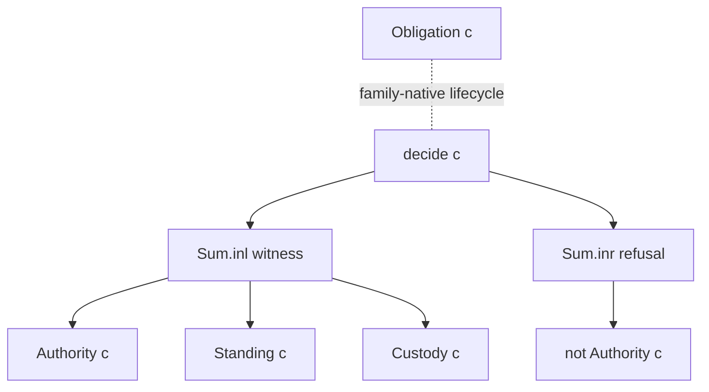

# 3. Books, authority, and checking

## Three separate books

For a claim `c`, a governed family carries three independent propositions:

```lean
F.Standing c
F.Custody c
F.Obligation c
```

Standing records the pre-claim basis required by the family. Custody records
provenance intactness. Obligation records outstanding duties. They are separate
because the public examples make different combinations meaningful:

- the bare paid claim has custody vacuously but no authority
  ([`custody_does_not_grant_dynamic_authority`](../../LeanProofs/Admissibility/Calculus/Instances/BoundedPaidReachability.lean#L181));
- the BreakGlass audit-laundering claim has settlement standing but is refused
  by the independent audit-history condition
  ([`audit_launder_has_settlement_standing`](../../LeanProofs/Admissibility/Calculus/Instances/BreakGlass.lean#L359));
- BreakGlass obligation is absent before commit, live at commit, and closed at
  settlement
  ([three lifecycle theorems](../../LeanProofs/Admissibility/Calculus/Instances/BreakGlass.lean#L306)).

Collapsing the books into a single “good” predicate would erase exactly these
states. The abstraction exports no theorem `Standing c → Authority c`,
`Custody c → Authority c`, or `¬ Obligation c → Authority c`.

## Authority is derived

Authority is not a field supplied by an instance:

```lean
def GovernedFamily.Authority (c : F.Claim) : Prop :=
  Nonempty (F.Witness c)
```

([source](../../LeanProofs/Admissibility/Calculus/Core.lean#L107)). Thus an
instance cannot install a second authority introduction rule while still using
this definition. Authority deliberately squashes witness identity. The theorem
[`authority_has_no_multiplicity`](../../LeanProofs/Admissibility/Calculus/Core.lean#L133)
makes that explicit: consumers that count receipts must count native `Witness`
data, not proofs of `Authority`.

> **Theorem — `authority_requires_standing`.** Authority entails standing
> because every contained witness must entail standing. It does not say that
> standing suffices.

> **Theorem — `authority_preserves_custody`.** Authority entails custody
> because every contained witness preserves custody. It does not say that
> custody supplies or repairs a witness.

> **Theorem — `refusal_refutes_authority`.** Native refusal evidence and
> authority cannot coexist, by the family's `exclusive` law.

## The total evidence-returning checker

The checker has the exact shape

```lean
F.decide : (c : F.Claim) → Sum (F.Witness c) (F.Refusal c)
```

It is total because every input claim produces one branch. It is not a generic
search procedure: each instance supplies its own implementation. For example,
the paid family uses a hand-written two-constructor match
([source](../../LeanProofs/Admissibility/Calculus/Instances/BoundedPaidReachability.lean#L149));
this proves no arbitrary reachability decision algorithm.

The Boolean branch view is derived only after the native artifact exists:

```lean
F.Authority c ↔ (F.decide c).isLeft = true
```

([`authority_iff_decide_isLeft`](../../LeanProofs/Admissibility/Calculus/Core.lean#L139)).
This Boolean is a view of a stored `Sum`; it is not the checker contract and
cannot recover refusal data by itself.



The diagram contains no arrow from any book back into `Authority`. That absence
is part of the signature's meaning.
