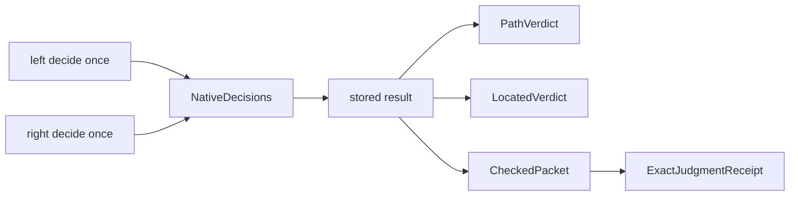

# 6. Comparison and stored decisions

## A constitutional comparison framework

The comparison layer fixes seven semantic slots in `EntryIndex` and proves that
their enumeration is duplicate-free and has length seven
([source](../../LeanProofs/Admissibility/Calculus/Comparison.lean#L68)). These
constructors are constitutional indices, not seven public comparison results.

Each `IndexedEntry index` contains one source/target `Projection`, a comparison
kind, the dependent law required by that kind, source pins, capability receipts,
and at least one explicit nonclaim
([source](../../LeanProofs/Admissibility/Calculus/Comparison.lean#L410)). A
`Ledger` is total by construction because it must supply an entry for every
index
([`Ledger.covers`](../../LeanProofs/Admissibility/Calculus/Comparison.lean#L424)).

The four primary law shapes are:

- `ExactJudgmentReceipt`: source judgment iff target judgment after the one
  declared map;
- `ExactRepresentationReceipt`: judgment exactness plus a two-sided partial
  decoder contract;
- `DirectionalWithLossReceipt`: preservation plus an explicit distinct source
  pair collapsed by that same map;
- `SeparationReceipt`: an inhabited source-positive image rejected by the
  target, plus a target-positive control.

Their definitions are
[`ComparisonKind` and receipt structures](../../LeanProofs/Admissibility/Calculus/Comparison.lean#L189).
Dependent selection by `ComparisonLaw` prevents storing an “exact” label without
constructing its corresponding receipt.

> **Theorem — `ExactRepresentationReceipt.map_injective`.** Complete recovery
> implies that the declared map is injective
> ([source](../../LeanProofs/Admissibility/Calculus/Comparison.lean#L269)).

> **Theorem — `DirectionalWithLossReceipt.no_left_inverse`.** The stored
> collapsed pair rules out a decoder recovering every source
> ([source](../../LeanProofs/Admissibility/Calculus/Comparison.lean#L295)).

> **Theorem — `SeparationReceipt.not_universal_preservation`.** The receipt's
> own counterexample refutes universal preservation through its declared map
> ([source](../../LeanProofs/Admissibility/Calculus/Comparison.lean#L312)).

Capability support is also proof-bearing: `supported` contains an
entry-specific receipt, while `unsupported` contains a classified reason
([source](../../LeanProofs/Admissibility/Calculus/Comparison.lean#L328)).

### The crucial custody limit

The instantiated seven-entry comparison table and its native adapters are not
in the public Lean surface. They remain receipt-bound research-tree evidence.
The public theorem establishes the exhaustive *shape* any such ledger must
inhabit, not a universal subsumption theorem between all seven source families.
This is stated in the [rung-5 admission fence](../V14-READINESS-LEDGER.md#rung-5--the-indexed-comparison-framework-admitted-2026-07-18)
and [claim-register entry 23](../../CLAIM-REGISTER.md#23-v14-rung-5--indexed-comparison-framework).

## Decide once, then project

The crossing contract combines exactly two governed families with lossless
refusal encodings
([`Crossing.Spec`](../../LeanProofs/Admissibility/Calculus/Crossing.lean#L59)).
Its native evaluation is deliberately concentrated:

```lean
def check (S : Spec) (c : Claim S) : CheckedCrossing S c where
  native := {
    left := S.leftFamily.decide c.left
    right := S.rightFamily.decide c.right
  }
```

([source](../../LeanProofs/Admissibility/Calculus/Crossing.lean#L102)). The two
results are stored in `NativeDecisions`. `result`, `verdict`, and `located` are
pure functions of that stored pair. They do not call a native checker again.

This matters whenever checking could be expensive, state-sensitive, or
noncanonical in its witness data. A consumer may inspect the stored decision,
derive the branch Boolean, project a verdict, or produce a comparison receipt;
it may not silently re-decide and assume that a new result is the stored one.



The crossing refusal type retains successful evidence in a mixed branch and
both refusals in a double failure
([source](../../LeanProofs/Admissibility/Calculus/Crossing.lean#L75)). The theorem
[`both_refusals_located_and_decode`](../../LeanProofs/Admissibility/Calculus/Crossing.lean#L342)
shows that both locations appear in order and each refusal decodes to its exact
native packet. Composite authority is exactly the conjunction of the two native
authorities
([`authority_iff_components`](../../LeanProofs/Admissibility/Calculus/Crossing.lean#L180)).

The comparison projection over a `CheckedPacket` is the identity map between
two observations of the already-stored packet
([`checkedProjectionExact`](../../LeanProofs/Admissibility/Calculus/Crossing.lean#L393)).
It proves judgment agreement; it is not permission to evaluate again.
