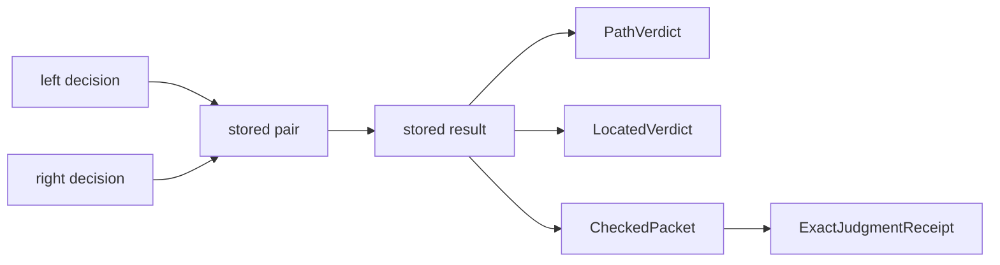

# 6. Comparison and stored decisions

## Comparison without forced unification

Two systems can be compared without pretending they share one claim type or
one native semantics. A comparison record starts with a source judgment, a
target judgment, and one declared map between them. It must then prove what
kind of comparison that map supports.

The source and target are `JudgmentView` values: each names a carrier and a
predicate. A `Projection` supplies the single map used by the receipt
([source](../../LeanProofs/Admissibility/Calculus/Comparison.lean#L168)). Using
one map prevents a proof from relying on a convenient forward translation and
a different, unrelated reverse translation.

The framework distinguishes four relations:

- `ExactJudgmentReceipt`: the source predicate holds exactly when the mapped
  target predicate holds;
- `ExactRepresentationReceipt`: exact judgment plus a canonical partial
  decoder that recovers every source value;
- `DirectionalWithLossReceipt`: forward preservation plus an explicit pair of
  distinct positive source values collapsed by the map;
- `SeparationReceipt`: a source-positive value whose image is target-negative,
  together with a target-positive control.

The distinction between exact judgment and exact representation is
load-bearing. A map may preserve a predicate perfectly while merging several
positive source values. Exact representation adds recovery and therefore
implies injectivity
([`ExactRepresentationReceipt.map_injective`](../../LeanProofs/Admissibility/Calculus/Comparison.lean#L269)).

Directional loss states its missing information positively. The stored
collapsed pair rules out any decoder that recovers every source
([`DirectionalWithLossReceipt.no_left_inverse`](../../LeanProofs/Admissibility/Calculus/Comparison.lean#L295)).
A separation receipt supplies a concrete counterexample to universal
preservation rather than merely omitting a forward law
([`SeparationReceipt.not_universal_preservation`](../../LeanProofs/Admissibility/Calculus/Comparison.lean#L312)).

> **Example.** BreakGlass uses separation. Exceptional authority maps to a
> retained ordinary verdict that is denied; a separate positive target control
> shows that ordinary authorization is not an empty judgment. The result does
> not unify exceptional and ordinary authority. It proves that the proposed
> embedding fails.

## The indexed ledger shape

`EntryIndex` names seven reviewed semantic slots. An `IndexedEntry` contains a
projection, one of the four law shapes, source pins, capability receipts, and
at least one explicit nonclaim
([source](../../LeanProofs/Admissibility/Calculus/Comparison.lean#L410)). A
`Ledger` is total by construction because it supplies an entry for every index
([`Ledger.covers`](../../LeanProofs/Admissibility/Calculus/Comparison.lean#L424)).

Capability status is proof-bearing. `supported` contains the required receipt;
`unsupported` contains a classified reason
([source](../../LeanProofs/Admissibility/Calculus/Comparison.lean#L328)). A label
such as “exact” cannot be stored without the corresponding dependent law.

> **Repository status.** The public Lean surface defines this exhaustive
> framework. The concrete seven-entry table and its native adapters are
> retained supporting evidence, not public Lean doctrine. The framework does
> not prove that all seven native sources share one semantics. See
> [claim-register entry 23](../../CLAIM-REGISTER.md#23-v14-rung-5--the-indexed-comparison-framework)
> for the exact publication boundary.

## Decide once, then project

Rerunning a checker can change the evidence being discussed. A checker may be
expensive or state-sensitive, and two successful runs may return different
witness data. A summary computed now and an explanation recomputed later need
not describe one event.

A **crossing** combines exactly two governed families with exact refusal
encodings. It evaluates both native decisions once and stores the pair:

```lean
def check (S : Spec) (c : Claim S) : CheckedCrossing S c where
  native := {
    left := S.leftFamily.decide c.left
    right := S.rightFamily.decide c.right
  }
```

([source](../../LeanProofs/Admissibility/Calculus/Crossing.lean#L102)).
`result`, `verdict`, and `located` are pure functions of the stored
`NativeDecisions`; none calls a native checker again.



The mixed branches retain the successful witness beside the refusal. The
double-failure branch retains both refusals. The theorem
[`both_refusals_located_and_decode`](../../LeanProofs/Admissibility/Calculus/Crossing.lean#L342)
shows that both locations appear in order and that each obstruction decodes to
its exact native packet.

Composite authority is exactly the conjunction of the two component
authorities
([`authority_iff_components`](../../LeanProofs/Admissibility/Calculus/Crossing.lean#L180)).
One successful component cannot cure the other component's refusal.

The comparison projection over a `CheckedPacket` compares two observations of
the already-stored packet
([`checkedProjectionExact`](../../LeanProofs/Admissibility/Calculus/Crossing.lean#L393)).
It proves judgment agreement for that stored decision. It is not permission to
evaluate either family again.

> **Core/instance boundary.** Crossing supplies binary evidence composition.
> It introduces no payment rule, obligation interaction, lifecycle semantics,
> or N-ary composition theorem.
