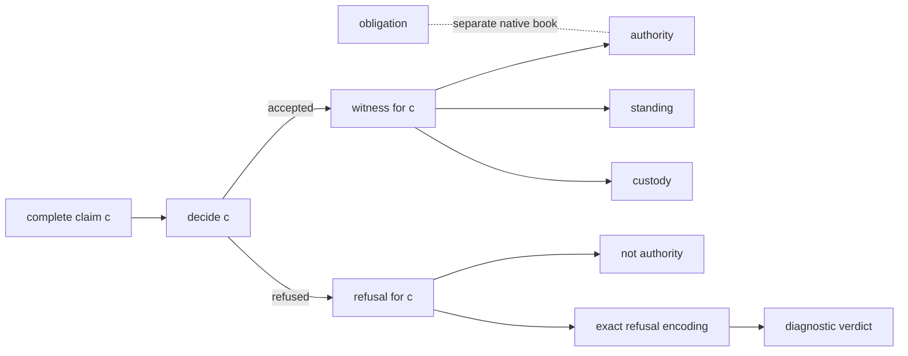

# The Governed Admissibility Calculus

This is a formal-methods treatment of governed computation, not a blockchain,
legal-evidence, smart-contract, audit-log, or category-theory system. The
calculus asks which evidence justifies a claim while keeping standing,
custody, authority, refusal, and obligation distinct. The repository-wide
[plain-language orientation](../PLAIN-LANGUAGE-SUMMARY.md) explains how this
v14 calculus sits beside the three-domain v15 Atlas.

This documentation has three entrances. Choose the one that matches the
question you are trying to answer; none requires prior knowledge of the
repository’s release history.

The common subject is a calculus for evidence-bearing judgments. A complete
**claim** is decided by returning either a claim-indexed **witness** or a
claim-indexed **refusal**. **Authority** means that a witness exists. Standing,
custody, and obligation remain separate books, and translations must state
exactly which judgment or representation they preserve.

## Conceptual exposition

Read [The Governed Admissibility Calculus](GOVERNED-ADMISSIBILITY-CALCULUS.md)
if you want the easiest entrance. It develops the intellectual problem in
ordinary language through four recurring examples:

- a green health endpoint over a stalled evidence pipeline;
- funded and bare claims that reach the same visible endpoint;
- stale evidence that supports downgrade but not direct testimony;
- exceptional BreakGlass authority that preserves ordinary denial and audit
  history.

Formal names appear only after the underlying idea has been introduced. Lean
anchors are short, optional sections.

## Mathematical calculus

Read [A Mathematical Presentation](GOVERNED-ADMISSIBILITY-CALCULUS-TEXTBOOK.md)
if you want definitions, inference rules, derivations, and counterexamples in
paper notation. Each display is marked as a definition, primitive law, generic
theorem, instance theorem, countermodel, or explanatory boundary. The text
separates the mathematical rule from its Lean anchor.

This path assumes comfort with dependent types, sums, predicates, and basic
proof notation, but not knowledge of the project’s campaign terminology.

## Lean and audit reference

Use the numbered chapters when you need a declaration-grounded account:

1. [Motivation and scope](01-motivation-and-scope.md)
2. [The governed family](02-governed-family.md)
3. [Books, authority, and checking](03-books-authority-and-checking.md)
4. [Witnesses, refusals, and lossless encoding](04-witnesses-refusals-and-lossless-encoding.md)
5. [Domains, location, and transport](05-domains-location-and-transport.md)
6. [Comparison and stored decisions](06-comparison-and-stored-decisions.md)
7. [Concrete instances](07-concrete-instances.md)
8. [Boundaries, countermodels, and nonclaims](08-boundaries-countermodels-and-nonclaims.md)
9. [Reading the Lean](09-reading-the-lean.md)

The [glossary](glossary.md) defines project vocabulary. The
[declaration index](declaration-index.md) maps principal prose claims to exact
Lean declarations and is the fastest route from a statement in either book to
its implementation.

This layer is intentionally denser. It is for readers checking theorem scope,
core-versus-instance boundaries, source locations, or proof status.

## The system at a glance

Every arrow is one-way unless an equivalence is explicitly proved. Standing,
custody, and absence of obligation do not create authority. The core calculus
does not impose an obligation lifecycle; the bounded BreakGlass instance
supplies one for its own claims.

## Formal and repository status

The public Lean root is
[`LeanProofs.Admissibility.Calculus`](../../LeanProofs/Admissibility/Calculus.lean).
Its exact imports, theorem footprints, and publication status are repository
facts rather than premises of the mathematical exposition.

The [claim register](../../CLAIM-REGISTER.md) records claim-level status. The
[readiness ledger](../V14-READINESS-LEDGER.md) preserves detailed admission
history and proof accounting. The declaration index links the mathematics to
the public source without requiring either ledger as introductory reading.

No chapter claims that a runtime conforms to these definitions. Runtime
conformance requires a separate correspondence proof and executable,
revision-bound evidence.
