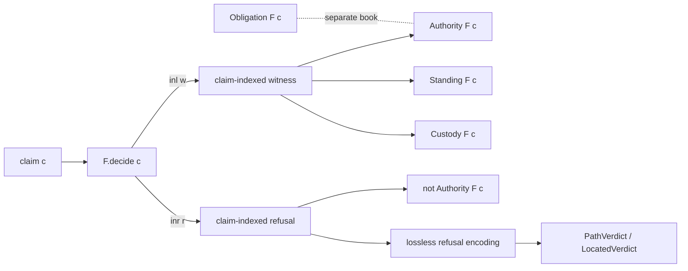

# The Governed Admissibility Calculus

This book documents the ratified public object imported by
[`LeanProofs.Admissibility.Calculus`](../../LeanProofs/Admissibility/Calculus.lean#L37).
It is an account of the Lean implementation, not a reconstruction from the
papers. The recurring question is:

> When is a representation entitled to speak for reality?

The calculus gives a deliberately bounded answer. A claim is entitled when its
native governed family returns claim-indexed witness data. Such a witness must
come from a claim with standing and must preserve custody. Outstanding
obligations remain a separate book. A refusal is not the absence of a proof or
a failed Boolean: it is native, claim-indexed data. The total checker returns
one of those two artifacts.

The answer is therefore not a single global `Admissible` judgment. It is a
common *shape* inhabited by different native judgments, plus explicit laws for
transport, comparison, and binary crossing. The stable root imports twelve
modules; its full frozen theorem footprint is 191 calculus receipts plus the
36-receipt `PathVerdict` substrate. The counts and axiom classes are enforced by
[`check-calculus-footprint.sh`](../../scripts/check-calculus-footprint.sh) and
[`check-pathverdict-footprint.sh`](../../scripts/check-pathverdict-footprint.sh).

## Reading order

1. [Motivation and scope](01-motivation-and-scope.md)
2. [The governed family](02-governed-family.md)
3. [Books, authority, and checking](03-books-authority-and-checking.md)
4. [Witnesses, refusals, and lossless encoding](04-witnesses-refusals-and-lossless-encoding.md)
5. [Domains, location, and transport](05-domains-location-and-transport.md)
6. [Comparison and stored decisions](06-comparison-and-stored-decisions.md)
7. [Concrete instances](07-concrete-instances.md)
8. [Boundaries, countermodels, and nonclaims](08-boundaries-countermodels-and-nonclaims.md)
9. [Reading the Lean](09-reading-the-lean.md)

Reference material: [declaration index](declaration-index.md) and
[glossary](glossary.md).

## The system at a glance

The arrows labeled by theorems are one-way unless an equivalence is stated.
In particular, standing, custody, and absence of obligation do not introduce
authority. The exact fields and laws are in
[`GovernedFamily`](../../LeanProofs/Admissibility/Calculus/Core.lean#L77).

## Authority and custody of this documentation

Mathematical claims in these chapters link to exact declarations. Promotion,
release, and runtime-conformance claims instead cite repository custody records,
principally [claim-register entries 19–25](../../CLAIM-REGISTER.md#19-v14-rung-1--pathverdict-domainslocated-substrate),
the [v14 readiness ledger](../V14-READINESS-LEDGER.md), and the
[v14 release ledger](../V14-RELEASE-LEDGER.md). Compiling a module, importing it
through an aggregate, and promoting it to a stable surface are different acts;
the repository's [agent rules](../../AGENTS.md) state that distinction.

No chapter claims that a runtime conforms to these definitions. The stable
root itself requires an exact correspondence map, executable preservation and
transport evidence, and revision-bound qualification receipts for such a claim
([root header](../../LeanProofs/Admissibility/Calculus.lean#L23)).
