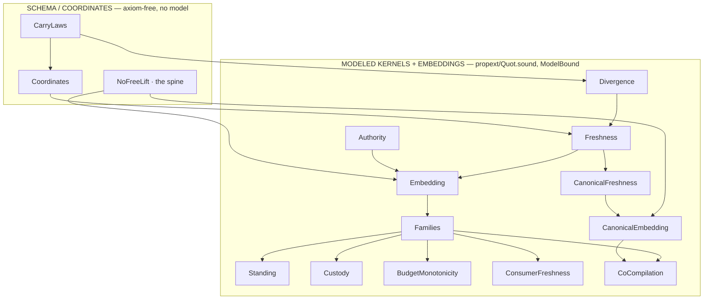
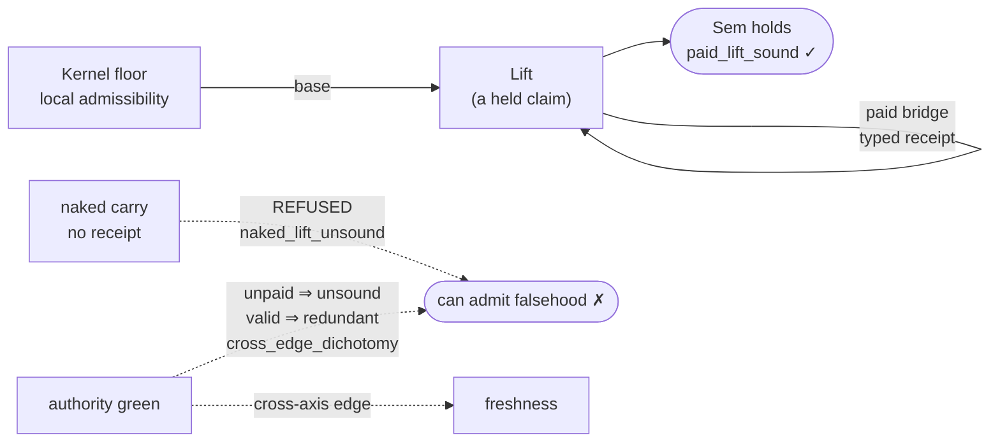
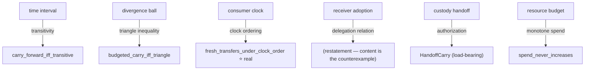

# Wired ↔ Atlas map (diagrams + Rosetta)

Documentation only — frozen state. The wired Lean structure is the abstract,
machine-checked form of the discipline `~/git/intake-composition-atlas` already
enforces on real data flows: **typed, receipt-backed edges; no free movement.**

## 1. Module DAG (what imports what)

## 2. The customs office (the semantic story)

## 3. Cost map — each bridge pays exactly its coordinate's structure

## 4. Rosetta — wired Lean (formal) ↔ intake-composition-atlas (world)

| wired Lean (proves the *shape*) | atlas (instantiates on real flows) |
| ------------------------------- | ---------------------------------- |
| Kernel floor — local admissibility | a node's `documented` claim (witnessed by `cma`/`sorn`/`pia`/…) |
| paid Bridge = a typed receipt | every edge carries **one claim type + ≥1 receipt** |
| `naked_lift_unsound` (no-receipt move is unsound) | `fixtures/fail/no-receipt.yaml` → lint **fails** |
| `no_free_lift` (traces to a kernel-floor grant) | `inferred` needs a derivation; depth-1 cap; **no inferred parent** |
| `cross_edge_dichotomy` — authority-green ≠ fresh | `authorized` ≠ `documented`; doctrine **`signed_is_not_witnessed`** |
| `valid_cross_bridge_is_redundant` | a routine-use clause `authorizes` but does not `witness` the flow |
| Standing / ConsumerFreshness (receiver-relative) | `contestation_required_on` edges: `notice` / `appeal` per receiver |
| Custody `custody_originates_from_grant` (non-manufacture) | `shares_with` / CMA provenance must trace to a basis |
| BudgetMonotonicity `spend_never_increases` | budgeted disclosure does not mint new authority |
| **proof-as-evidence-not-receipt** fence | a build *attests* the math; a `receipt` *witnesses* a flow; **admission is a separate act** |

## The one-line takeaway

The atlas says, operationally: *no edge without a typed receipt, and an
authorization is not a witness.* The wired Lean proves, abstractly: *no lift
without a paid bridge, and `naked_lift_unsound` / `cross_edge_dichotomy` make the
unreceipted and the authority-as-witness moves provably unsound.* Same doctrine,
two registers — one checked by a linter over real statutes, one checked by Lean
over its definitions. Neither one admits a world claim by itself; both are
evidence into a gate a human still runs.
